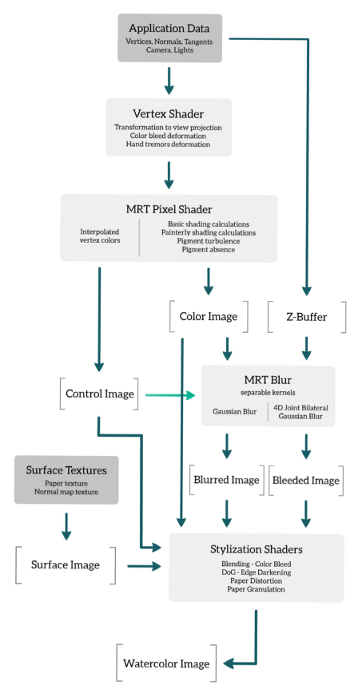
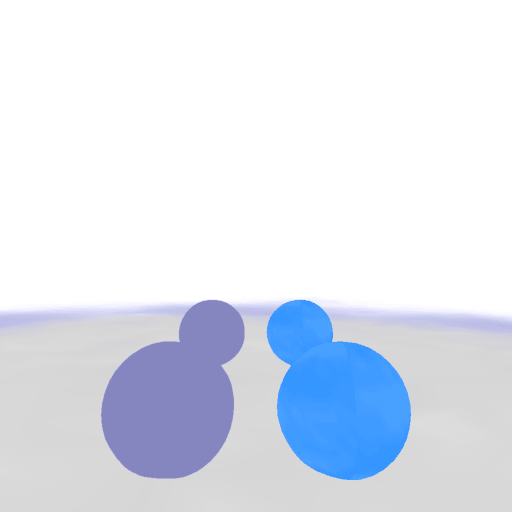
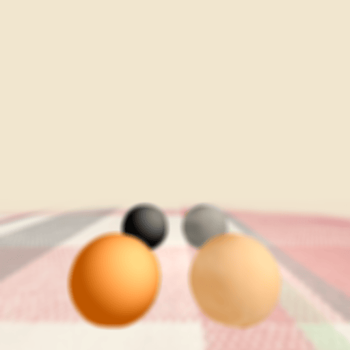
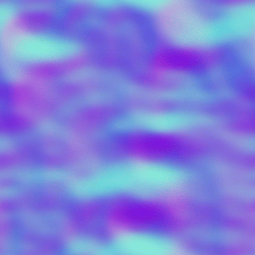
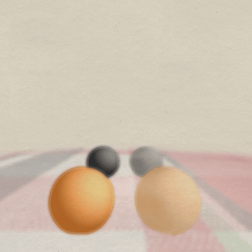
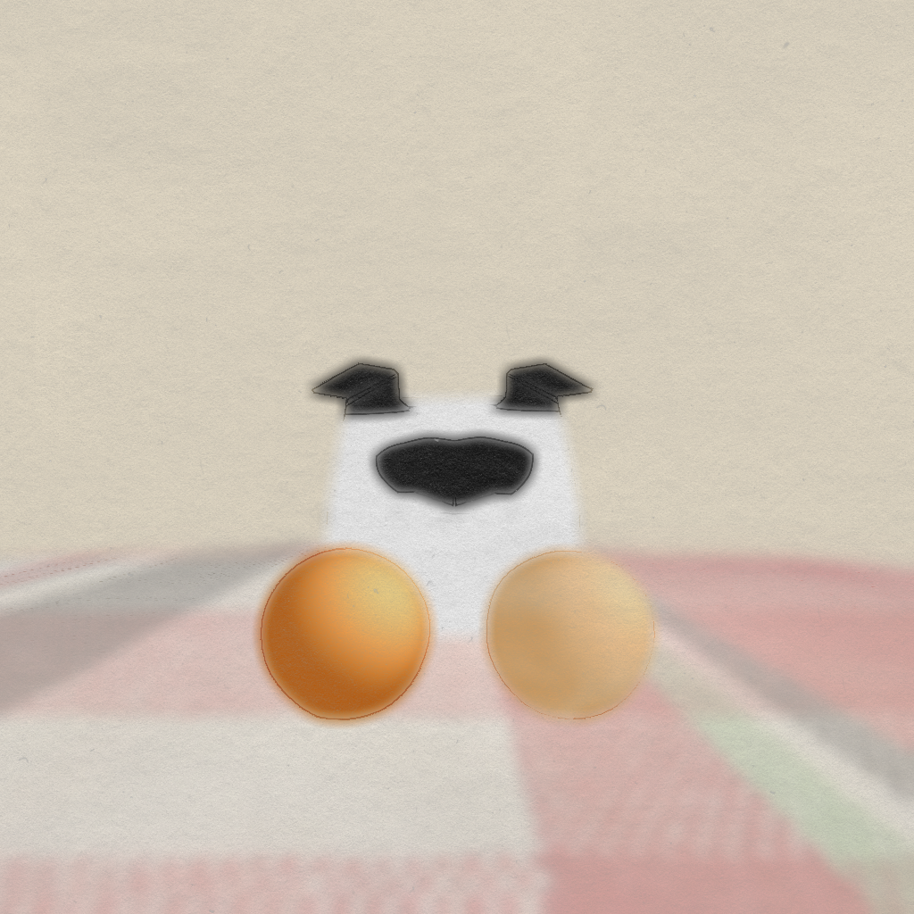

# Watercolor Shader Project
Hello! This is a project final for my CS216 class with Kevin Smith. I wrote an implementation for a real-time watercolor style post-processing effect, mostly within GLSL shaders. Right now, the shaders are tied to working in OpenFrameworks, but with slight tweaks they could be applied to many different rendering pipelines. This project wasn't built with replication/portability as the main focus. Instead, this repo serves a gallery & blog of my thoughts.

## Introduction
In ["Art-directed watercolor stylization of 3D animations in real-time"](https://www.sciencedirect.com/science/article/abs/pii/S0097849317300316) by Montesdeoca et al., they describe a post-processing pipelinebased on the physical attributes of the paint to render a scene/image in a watercolor style. The various stages of the pipeline that replicate various physical properties such as color bleeding, edge darkening, and pigment turbulence can be controlled using the vertex colors of the geometry - giving individual artists the ability to express unique styles within this single pipeline.

## Implementation
Ideally, I wanted to implement this system within a game engine such as Unreal Engine so that I could stress test its effectiveness inside scenes with complex geometry. However, in the interest of submitting my project on time, I opted to use a framework that was more familiar to me so that I could focus on writing the shaders: [OpenFrameworks](https://openframeworks.cc/). 

### Summary
For a high level overview of the system, the paper provides the following diagram:   
  
#### First Pass
The final style consists of a series of shaders that emulate different traits of the physical paint medium. In our first pass, we physically offset the position of our vertices to simulate errors from hand tremors (Vertex Shader) and perform basic shading calculations.   

   
On the left is the scene output, and on the right is an image containing the vertex colors of that output. The first fragment shader (MRT Pixel Shader) is our first example of using our vertex colors to direct the output of the pipeline. The alpha channel contains the values of a noise texture, which is used to alter the pass output.   
#### Intermediate Image Creation
In our intermediate phase, we aim to create three images that we use to create our final image. 
First, there is a simple gaussian blur of our scene output using a 5x5 kernel.  

 More interestingly, the second image is a bleed algorithm as described by the paper. Simple bleeding doesn't accurately portray the properties of paint when wet & dry paint interact with one another in different layers. For example, in a normal bleed algorithm, a "dry" background will end up bleeding into the newer "wet" foreground. The "4D joint-bilateral bleed algorithm" amends this to allow artists to designate colors should be bled according to their depth in the image. This means that the designated bleed areas (vertex color blue channel) should be allowed to bleed, but the ground plane located in the background should not bleed into the spheres.   
 
Our final image is a texture that compresses a paper's diffuse and normal textures into a single image. The xy vectors of the normal are stored in the rg channels, and the diffuse is used as a height value stored in the b channel.   
  
  

#### Final Stylization Pass
Once all the intermediate images have been made, the final pass combines them for the final effects. First, I created a new texture coordinate by taking the xy normal stored in the paper texture to offset our current texcoord. This simulates the effect of paint pooling into valleys due to the bumps in the paper texture. Using this offset, we sample our bleed image to alter the base scene output. Then we use the blur image in a difference-of-gaussians for an edge darkening effect. Finally, we use the heightmap stored in the blue channel of the paper texture to model the granulation of the paper.  

  
## Room for Improvements
### Testing
I was super happy on each step that I managed to even get an image output! However, there is much room for improvement within this project since I was rushing to get a baseline completed for project submission.   
Firstly, and most importantly, I didn't test my implementation very thoroughly. This was because of my lack of expertise in modeling. I did create a very simple 3D model of my dog, but it doesn't make great use of the vertex colors for customization. Neither did I test animations or complex scenes.  

  
(That boxy thing is supposed to be a dog. The black parts are his muzzle and ears. I have room for improvement in modeling.)  
### Efficiency
In addition to a lack of real-world testing, I think there's much room for efficiency improvement in the code, since this is one of my first times creating a shader like this. It achieved around ~90fps on my laptop, but that's on a VERY basic scene rendering two planes and some spheres. On a complex scene, that sounds like it would struggle greatly.  

- Bleed algorithm control flow could be cut down with better logic
- I created a lot of temporary variables for ease of use, but for pure efficiency there are a lot of shader chunks that could be condensed into fewer lines.
- Instead of using OpenFrameworks to manage my OpenGL calls, could've written my own OpenGL calls to decrease overhead.   

To list a few.

### Port to different platform
I would like to rewrite the code to test on a more portable and popular platform, such as a 3D rendering platform or a game engine. This would've eased attempts to test in real scenes as well as allowing others to try it out for themselves.

## Final Thoughts
This was a really fun project! I've never tried implementing something from a research paper before, so it was totally different from creating something from scratch or following a tutorial. I'm very grateful for the researchers made this pipeline in the first place; I'm not sure I would've ever thought those mathematical equations for physical modeling myself.   
  
It was really amazing to see how each intermediate image or effect built up into this final product. To be honest, I wasn't even quite sure through the process how these blurred/bleed/paper images I was working on would help create a painterly effect, but as soon as it was all assembled, suddenly it looked like a real image instead of a mess!  
  
I would like to thank Professor Kevin Smith for being a great teacher and introduction to the world of computer graphics.  